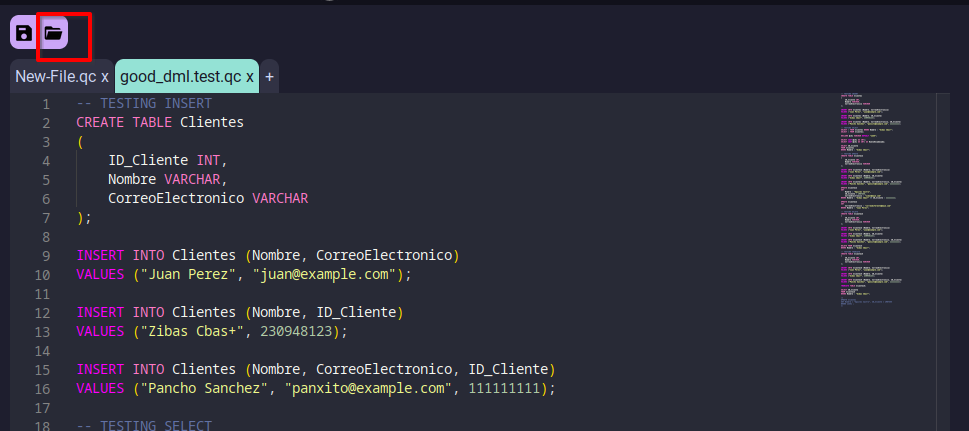
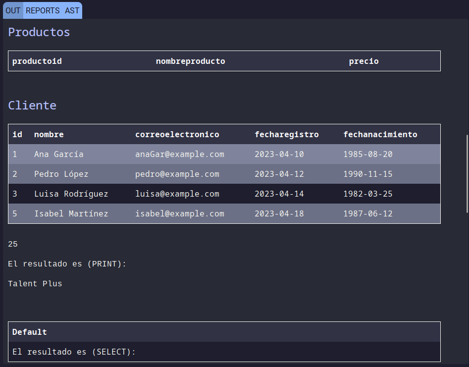

# 2nd Project - Organizacion de Lenguajes y Compiladores 1
### QueryCrypter
Sebastian Alejandro Vásquez Cartagena - 202109114


## User manual

        

1. Upload File
Click on the folder icon to open the file explorer, select a file to upload to the browser. Once the file is loaded it will open a new tab in the editor displaying the code in the file.

        


2. Download File
After editing a file in the editor, you can save the file clicking on the save icon. It will automatically download the file into the default downloads folder.

        

4. Code Editor
The code editor has almost the same functionality as any other basic editor. It has autocompletion, undo and redo capabitlities. and also copy, paste, cut text.
</br>
There are tabs that allow to switch between the windows of code that are loaded

        

    
3. Run Button
The run button is located at the bottom right of the screen. It sends the code to the backend to be interpreted.

        


### Output Window
The output window is useful to the display information about the executed code. It is composed of three main tabs.

        

1. Out Console
The out console displays the standard output of the program, Including syntax, semantic and lexical errors.

        

2. Reports Console
Here are the reports console. We can se the table of tokens, a lexical and syntax errors table, and the table of Symbols.

        

3. AST Window
The AST of the code is displayed in this window. The user has the capabitlity to zoom in, zoom out, and move the image to explore the generated AST
        


## Technical Manual
### Design

#### Frontend
The frontend was made in React library, using Typescript instead of pure Javascript
#### Backend
The backend was made in Nodejs and express library, using Typescript instead of Javascript

### Lexical Analisys

|Description|Regular Expression|Token Name|
|:-|:-|:-|
| word create | CREATE | RW_CREATE |
| word alter | ALTER | RW_ALTER |
| word drop | DROP | RW_DROP |
| word rename | RENAME | RW_RENAME |
| word insert | INSERT | RW_INSERT |
| word update | UPDATE | RW_UPDATE |
| word truncate | TRUNCATE | RW_TRUNCATE |
| word delete | DELETE | RW_DELETE |
| word select | SELECt | RW_SELECT |
| word from | FROM | RW_FROm |
| word where | WHERE | RW_WHERE |
| word into | INTO | RW_INTO |
| word values | VALUES | RW_VALUES |
| word add | ADD | RW_ADD |
| word column | COLUMN | RW_COLUMN |
| word rename | RENAME | RW_RENAMe |
| word TO | TO | RW_TO |
| word TABLE | TABLE | RW_TABLE |
| word int | INT | RW_INT |
| word double | DOUBLE | RW_DOUBLE |
| word date | DATE | RW_DATE |
| word varchar | VARCHAR | RW_VARCHAR |
| word boolean | BOOLEAN | RW_BOOLEAN |
| word TRUE | TRUE | RW_TRUE |
| word FALSE | FALSE | RW_FALSE |
| word NULL | nULL | RW_NULL |
| word NOT | NOT | RW_NOT |
| word AND | AND | RW_AND |
| word OR | OR | RW_OR |
| word begin | BEGIN | RW_BEGIN |
| word END | END | RW_END |
| word declare | declare | RW_DECLARE |
| word default | default | RW_DEFAULT |
| word set | SET | RW_SET |
| word AS | AS | RW_AS |
| word cast | CAST | RW_CAST |
| word print | PRINT | RW_PRINT |
| word if | IF | RW_IF |
| word then | THEN | RW_THEN |
| word else | ELSE | RW_ELSE |
| word case | CASE | RW_CASE |
| word when | WHEN | RW_WHEN |
| word while | WHILE | RW_WHILE |
| word for | FOR | RW_FOR |
| word in | IN | RW_IN |
| word LOOP | LOOP | RW_LOOP |
| word BREAK | BREAK | RW_BREAK |
| word continue | CONTINUE | RW_CONTINUE |
| word function | FUNCTION | RW_FUNCTION |
| word procedure | PROCEDURE | RW_PROCEDURE |
| word RETURNS | RETURNS | RW_RETURNS |
| word RETURN | RETURN | RW_RETURN |
|Spaces|\s+||
|Comments|"--".*||
|multiline comment|[/][*][^*]*[*]+([^/*][^*]*[*]+)*[/]||
|Tabs|[ \r\t]+||
|New lines|\n||


### Grammar
```java
ini::=
    instructions EOF 
|   EOF            


instructions::=
    instructions instruction TK_SCOLON  
|   instruction TK_SCOLON               


instruction::=
/*-------------------------------SQL LANGUAGE GRAMMARS-------------------------------*/
    ddl                     
|   dml                     
/*-------------------------------STRUCTURES-------------------------------*/
|   if_struct               
|   case_struct             
|   while_struct            
|   for_struct              
/*-------------------------------CONTROL-------------------------------*/
|   RW_BREAK                
|   RW_CONTINUE             
|   RW_RETURN expression    
|   RW_RETURN               
/*-------------------------------FUNCTIONS&METHODS-------------------------------*/
|   call_func_mth           
|   declare_function        
|   declare_method          
/*-------------------------------DECLARATION-------------------------------*/
|   declare_var             
|   set_var                 
/*-------------------------------ENV-------------------------------*/
|   encapsulated            
/*-------------------------------UTILITY-------------------------------*/
|   cast                    
|   print                   
|   error                   


/*-------------------------------SQL LANGUAGE GRAMMARS-------------------------------*/
ddl::=
    RW_CREATE RW_TABLE TK_ID TK_LPAR typed_arguments TK_RPAR    
|   RW_ALTER RW_TABLE TK_ID alter_actions                       
|   RW_DROP RW_TABLE TK_ID                                      


dml::=
    RW_INSERT RW_INTO TK_ID TK_LPAR arguments TK_RPAR RW_VALUES TK_LPAR value_arguments TK_RPAR 
|   select_stmt                                                                                 
|   RW_UPDATE TK_ID RW_SET set_arguments RW_WHERE where_cond                                    
|   RW_TRUNCATE RW_TABLE TK_ID                                                                  
|   RW_DELETE RW_FROM TK_ID RW_WHERE where_cond                                                 


alter_actions::=
    RW_ADD TK_ID type                        
|   RW_DROP RW_COLUMN TK_ID                 
|   RW_RENAME RW_TO TK_ID                   
|   RW_RENAME RW_COLUMN TK_ID RW_TO TK_ID   


select_stmt::=
    RW_SELECT select_arguments RW_FROM TK_ID                        
|   RW_SELECT select_arguments RW_FROM TK_ID RW_WHERE where_cond    
|   RW_SELECT expression RW_AS TK_ID                            
|   RW_SELECT expression                                        


where_cond::=
    expression  


/*-------------------------------ARGUMENTS-------------------------------*/
select_arguments::=
    TK_STAR         
|   value_arguments 


// TODO make this save the specified value
set_arguments::=
    set_arguments TK_COMA TK_ID TK_EQ expression 
|   TK_ID TK_EQ expression                       


value_arguments::=
    value_arguments TK_COMA expression  
|   expression                          


arguments::=
    arguments TK_COMA TK_ID 
|   TK_ID                   


typed_arguments::=
    typed_arguments TK_COMA TK_ID type 
|   TK_ID type                          


typed_var_arguments::=
    typed_var_arguments TK_COMA TK_VAR type 
|   TK_VAR type                             


/*-------------------------------TYPE-------------------------------*/
type::=
    RW_INT      { $$ = Primitive.INT }
|   RW_VARCHAR  { $$ = Primitive.VARCHAR }
|   RW_DOUBLE   { $$ = Primitive.DOUBLE }
|   RW_DATE     { $$ = Primitive.DATE }
|   RW_BOOLEAN  { $$ = Primitive.BOOLEAN }
|   RW_NULL     { $$ = Primitive.NULL }


/*-------------------------------STRUCTURES-------------------------------*/
if_struct::=
    RW_IF expression RW_THEN env RW_ELSE env RW_END RW_IF  
|   RW_IF expression RW_THEN RW_BEGIN env RW_END RW_IF     


case_struct::=
    searched_case   { $$ = $1 }
|   simple_case     { $$ = $1 }


simple_case::=
    RW_CASE expression simple_case_cases RW_ELSE primitive RW_END              
|   RW_CASE expression simple_case_cases RW_ELSE primitive RW_END RW_AS TK_VAR 


simple_case_cases::=
    simple_case_cases RW_WHEN primitive RW_THEN primitive   
|   RW_WHEN primitive RW_THEN primitive                     


searched_case::=
    RW_CASE searched_case_cases RW_ELSE primitive RW_END                
|   RW_CASE searched_case_cases RW_ELSE primitive RW_END RW_AS TK_VAR   


searched_case_cases::=
    searched_case_cases RW_WHEN expression RW_THEN primitive    
|   RW_WHEN expression RW_THEN primitive                        


while_struct::=
    RW_WHILE expression RW_BEGIN env RW_END 


for_struct::=
    RW_FOR TK_VAR RW_IN TK_INT TK_DOT TK_DOT TK_INT RW_BEGIN env RW_END RW_LOOP 


encapsulated::=
    RW_BEGIN env RW_END    


/*-------------------------------FUNCTIONS&METHODS-------------------------------*/
declare_function::=
    RW_CREATE RW_FUNCTION TK_ID TK_LPAR typed_var_arguments TK_RPAR RW_RETURNS type RW_BEGIN env RW_END 


declare_method::=
    RW_CREATE RW_PROCEDURE TK_ID typed_var_arguments RW_AS RW_BEGIN env RW_END  
|   RW_CREATE RW_PROCEDURE TK_ID RW_AS RW_BEGIN env RW_END  


/*-------------------------------DECLARATION-------------------------------*/
declare_var::=
    RW_DECLARE typed_var_arguments                  
|   RW_DECLARE TK_VAR type RW_DEFAULT expression    


set_var::=
    RW_SET TK_VAR TK_EQ expression  


/*-------------------------------ENVIRONMENTS-------------------------------*/

env::=
    instructions    
|                   


/*-------------------------------EXPRESSIONS-------------------------------*/
expression::=
    logic                       
|   relational                  
|   primitive                   
|   arithmetic                  
|   call_func_mth               
|   cast                        
|   TK_VAR                      
|   TK_ID                       
|   TK_LPAR expression TK_RPAR  
|   TK_LPAR select_stmt TK_RPAR 


relational::=
    expression TK_EQ expression         
|   expression TK_GEQ expression       
|   expression TK_LEQ expression       
|   expression TK_GREATER expression   
|   expression TK_LESS expression      
|   expression TK_NOTEQ expression     


logic::=
    expression RW_AND expression    
|   expression RW_OR expression     
|   RW_NOT expression              


primitive::=
    TK_INT      
|   TK_DOUBLE   
|   TK_DATE     
|   TK_VARCHAR  
|   RW_TRUE    
|   RW_FALSE    
|   RW_NULL     


arithmetic::=
    expression TK_PLUS expression       
|   expression TK_MINUS expression      
|   expression TK_DIV expression        
|   expression TK_STAR expression       
|   expression TK_MOD expression       
|   TK_MINUS expression %prec UMINUS    


    
call_func_mth::=
    TK_ID TK_LPAR value_arguments TK_RPAR   
|   TK_ID TK_LPAR TK_RPAR                   


/*-------------------------------FUNCTIONS-------------------------------*/
cast::=
    RW_CAST TK_LPAR expression RW_AS type TK_RPAR   


print::=
    RW_PRINT expression 

```
